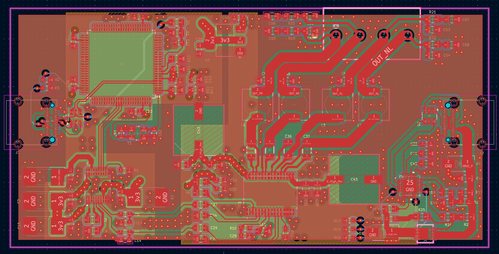
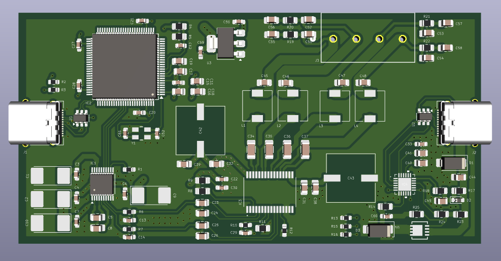
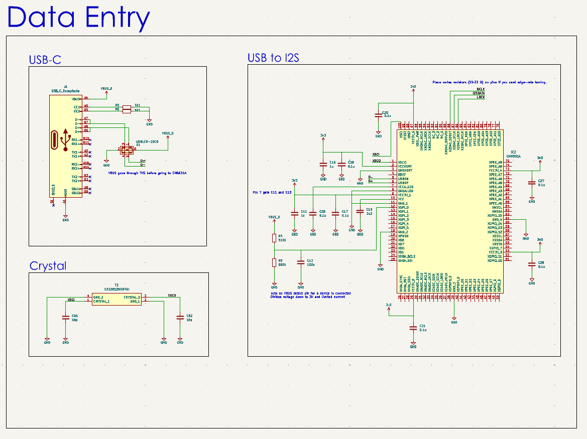
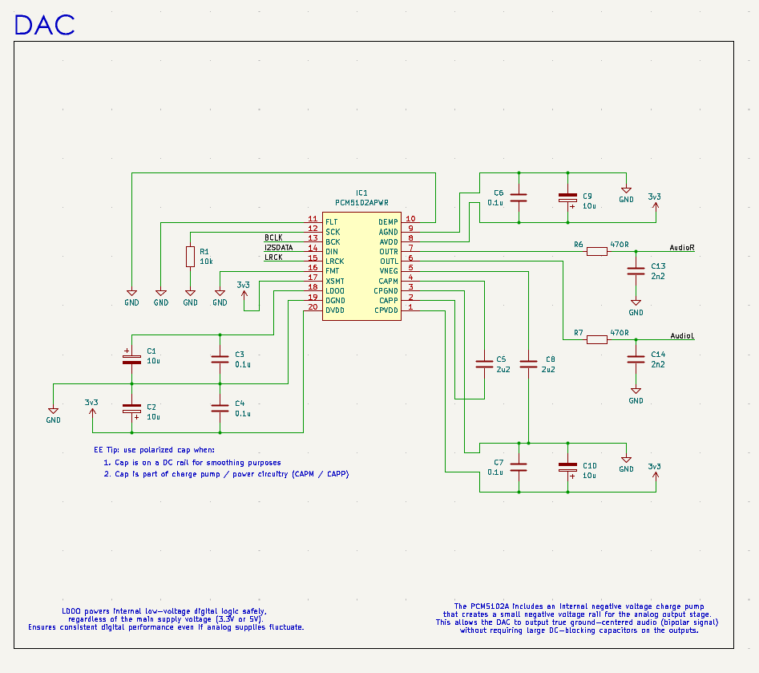
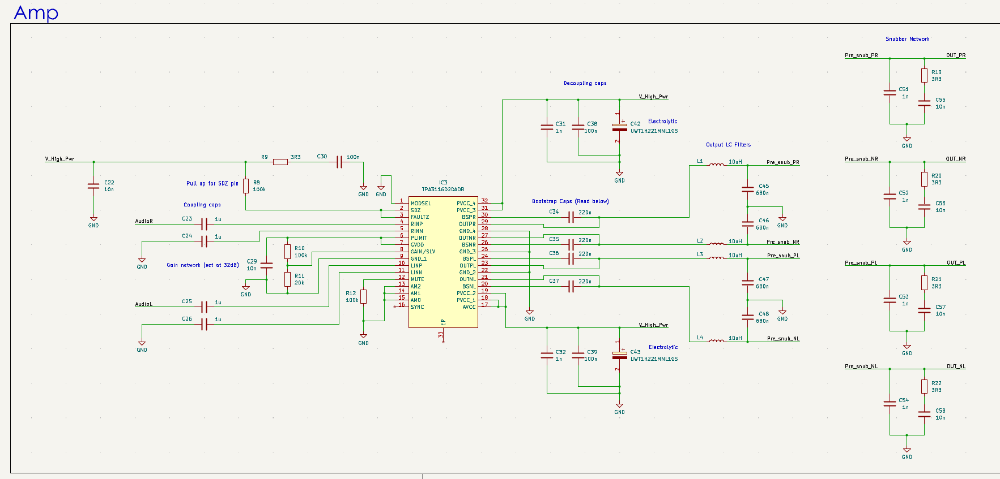
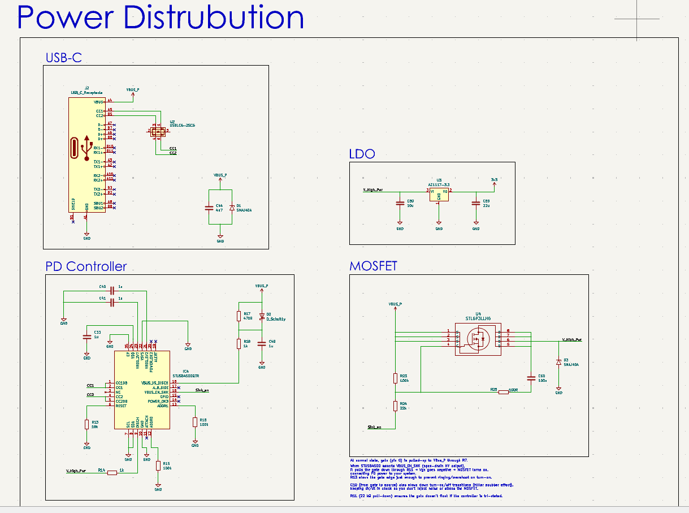

# USB-C DAC + Class-D Amplifier PCB

A custom PCB that integrates a **USB Audio Class 2.0 interface**, a **PCM DAC**, and a **Class-D stereo amplifier** into one design. The board takes **USB-C input** from a computer, negotiates **USB Power Delivery**, and directly drives passive speakers.

---

## 📐 PCB Overview

### Layout

* **4-layer stackup**: Signals / GND / Power / Signals.
* **Ground plane (L2)**: kept continuous.
* **VBUS path**: wide pours with TVS + PMOS protection.
* **Audio section**: isolated from noisy switching outputs.
* **Class-D outputs**: routed as wide paired traces (differential).

**PCB Layout View:**


**3D Render:**


---

## 🔎 Block Diagram

```
      ┌───────────┐        ┌─────────┐        ┌─────────────┐        ┌──────────┐
USB-C │           │  I²S   │         │  L/R   │             │  PWM   │          │
Port──► CM6631A   ├────────► PCM5102A├────────► TPA3116D2   ├────────► LC + RC  ├─► Speakers
      │ USB Audio │        │   DAC   │        │ Class-D Amp │        │ Filters  │
      └───────────┘        └─────────┘        └─────────────┘        └──────────┘
           │
           │ VBUS
           ▼
      ┌───────────┐
      │ STUSB4500 │  Negotiates 5/9/15/20 V
      │   PD Ctrl │  Controls PMOS Power Path
      └───────────┘
```

---

## 🧩 Subsystems

### 1. USB Audio Controller – CM6631A

* Handles **USB Audio Class 2.0**.
* Outputs I²S (`BCLK`, `LRCK`, `SDOUT`, optional `MCLK`).
* 12 MHz crystal with load capacitors.
* Powered from **3.3 V** with local decoupling.

**Schematic:**


### 2. DAC – PCM5102A

* Receives I²S from CM6631A.
* Produces stereo line-level analog.
* Runs without MCLK.
* Powered from **3.3 V**.

**Schematic:**


### 3. Amplifier – TPA3116D2

* Stereo Class-D amplifier (2×50 W @ 24 V / 4 Ω).
* Inputs: L/R analog (AC-coupled).
* Outputs: differential OUT+/OUT–.
* Key support:

  * **Bootstrap caps (220 nF)** at BST/OUT pins.
  * **LC output filters** (10 µH + 680 nF).
  * **Snubbers** near output terminals.
  * Gain set at **32 dB**.

**Schematic:**


### 4. USB-C Power Delivery – STUSB4500QTR

* Negotiates PD contract (up to 20 V).
* Drives **external PMOS switch** for safe power path.
* Protection:

  * TVS on VBUS.
  * Low-cap ESD on CC lines.
* Discharge network ensures safe detach.

**Schematic:**


---

## 🛠️ PCB Design Notes

* **VBUS copper pours** must be wide, low impedance.
* **CC lines**: short, referenced to ground (not differential).
* **Bootstrap & decoupling caps** placed as close as possible to IC pins.
* **Snubber loops**: compact, tied to PGND with short vias.
* **Audio/DAC section**: isolated from high-current Class-D switching.

---

## 🚧 Project Status

* ✅ Parts chosen (CM6631A, PCM5102A, TPA3116D2, STUSB4500).
* ✅ Schematic design.
* ✅ PCB layout Rev A (shown above).
* 🔜 Prototype fabrication & bring-up.
* 🔮 Rev B planned for EMI and audio performance refinements.

---

## 🌟 Future Plans

* Add headphone amplifier output.
* Upgrade DAC for higher fidelity.
* Add auxiliary 5 V buck regulator from PD rail.
* Explore XMOS USB interface for ASIO/UAC2 features.

