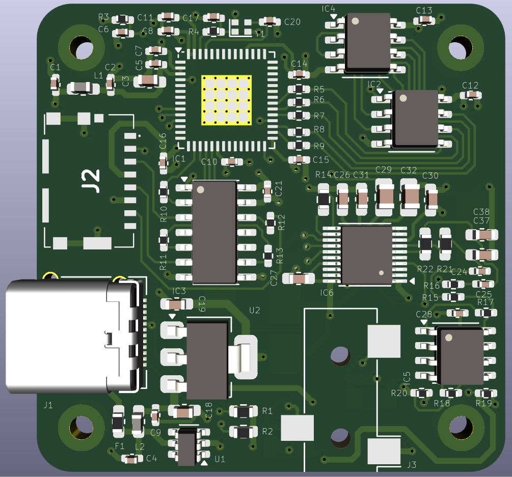
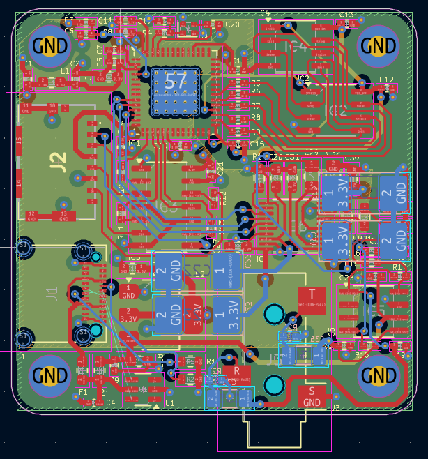
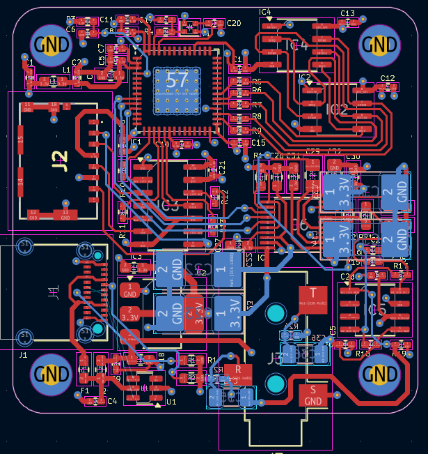
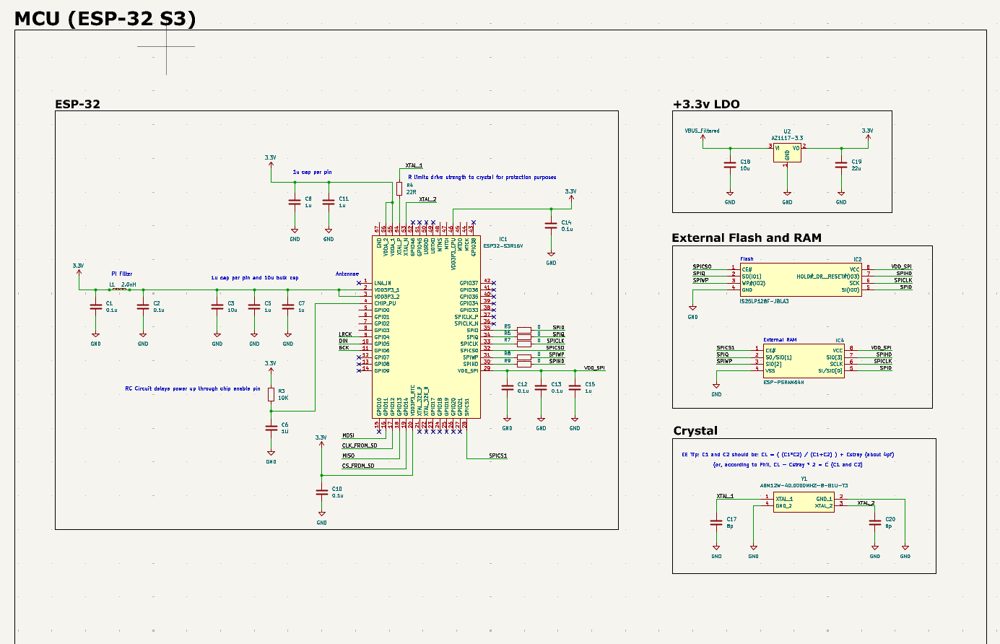
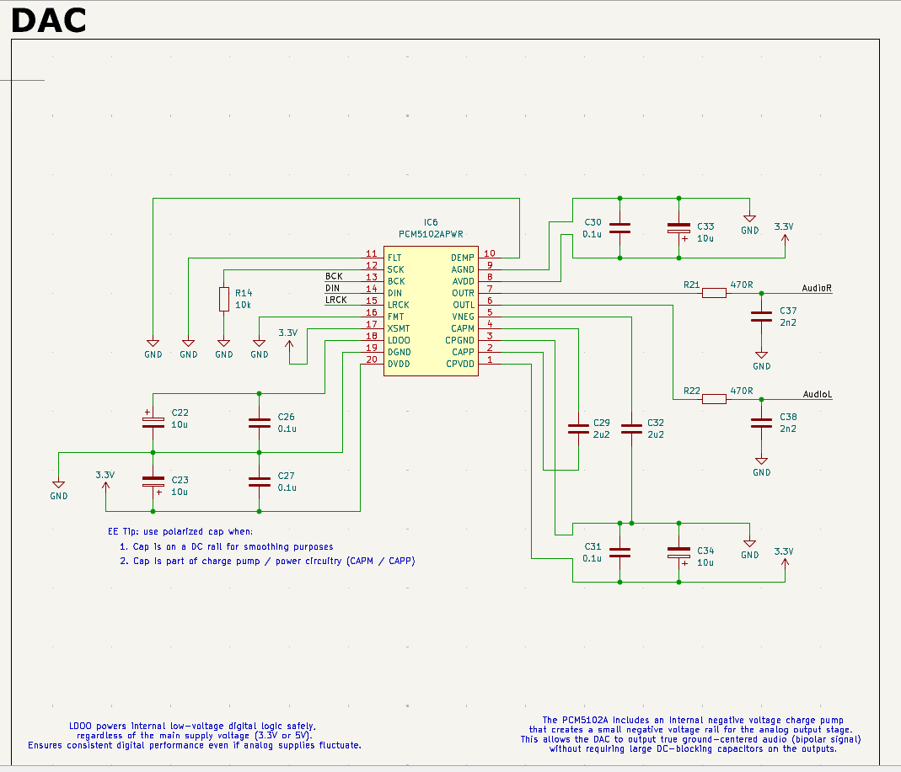
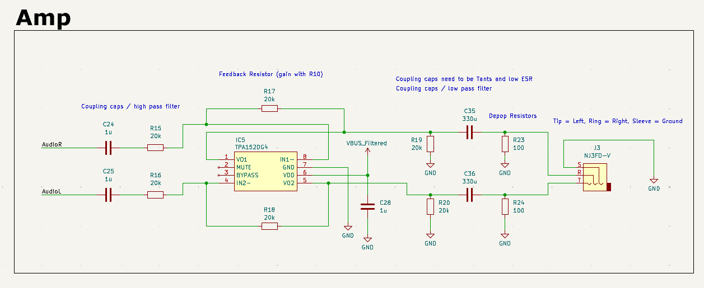
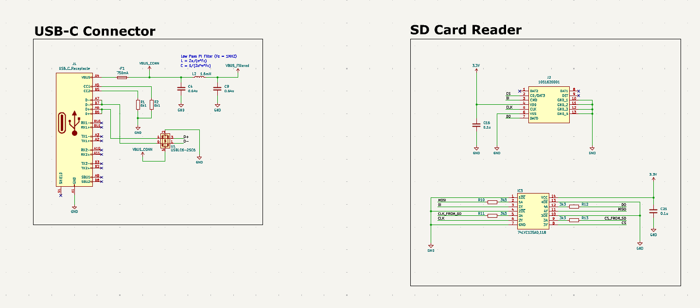

# 🎵 ESP32-S3 Digital Audio Player

An open-source, iPod-style audio player built around the ESP32-S3 microcontroller. Plays high-quality audio from a microSD card through a DAC and headphone amplifier, all powered by USB-C.

---

## 📷 Overview

This compact digital audio player leverages the power of the ESP32-S3 for audio decoding and control. Audio files are stored on a microSD card, decoded via I²S, and sent to a high-performance DAC, then amplified for headphone output. Ideal for embedded audio projects, MP3 players, or portable media devices.

---

## 🧩 Hardware Architecture

### 🧠 Microcontroller: [ESP32-S3](https://www.espressif.com/sites/default/files/documentation/esp32-s3_datasheet_en.pdf)
- Controls SD card interface, DAC, USB, and external memory
- I²S output for digital audio
- Wi-Fi/Bluetooth ready
- Uses external Flash + PSRAM for expanded storage and buffering

### 💾 Storage: [microSD Card Socket - Molex 1051620001](https://www.molex.com/en-us/products/part-detail/1051620001)
- SPI-connected via level-shifted interface
- Holds audio files (MP3, WAV, etc.)

### 🎧 Audio Chain
#### 1. [DAC: PCM5102A](https://www.ti.com/lit/ds/symlink/pcm5102a.pdf)
- Converts I²S digital audio to analog
- Internal charge pump for true ground-referenced output
- Low-pass filtered analog output

#### 2. [Amplifier: TPA152DG4](https://www.ti.com/lit/ds/symlink/tpa152.pdf)
- Drives headphones with clean audio
- Input high-pass and output low-pass filters
- Depop resistors prevent power-on pops
- 3.5mm stereo jack output

### 🔌 [USB-C Interface with USBLC6-2SC6](https://www.st.com/resource/en/datasheet/usblc6-2sc6.pdf)
- Accepts 5V power input
- ESD protected data lines (optional USB audio or serial)
- LC power filter for clean VBUS

### ⚡ [Power Regulation: AMS1117-3.3](https://www.advanced-monolithic.com/pdf/ds1117.pdf)
- Regulates 5V from USB down to 3.3V
- Decoupling and filtering for analog and digital domains

### 💾 External Memory
- [Flash: IS25LP128F-JBLE](https://www.issi.com/WW/pdf/25LP128F.pdf) – 128Mbit SPI NOR Flash
- [PSRAM: ESP-PSRAM64H](https://www.espressif.com/sites/default/files/documentation/esp-psram64h_datasheet_en.pdf) – 64Mbit SPI PSRAM

### 🔁 [Level Shifter: 74LVC125A](https://assets.nexperia.com/documents/data-sheet/74LVC125A.pdf)
- Used to safely drive the SD card's SPI interface from the 3.3V domain

---

## 🖼️ PCB Layout & 3D Render

| 3D Render | PCB Layout |
|----------|-------------|
|  |  |

| No Inner Layers View |
|----------------------|
|  |

---

## 📐 Schematic Overview

Each module is documented and separated for easy understanding:

| Module | Preview |
|--------|---------|
| **MCU (ESP32-S3)** |  |
| **DAC** |  |
| **Headphone Amp** |  |
| **USB-C & SD Card** |  |

---

## 🚧 Project Status

- [x] Schematic design complete  
- [x] PCB layout complete  
- [ ] Board fabrication and assembly  
- [ ] Firmware development (audio decoding, UI)  
- [ ] Enclosure design (optional)

---

## 🛠️ Tools Used

- **KiCad** for schematic and PCB
- **ESP-IDF** or **Arduino-ESP32** for firmware
- **UltraLibrarian** for footprint/symbol conversion

---

## 💡 Future Features

- OLED or LCD screen for UI
- Rotary encoder for navigation
- USB audio class support
- Bluetooth A2DP streaming

---

## 📄 License

This project is open-source under the MIT License. Feel free to fork, modify, and contribute!

---

## 🤝 Contributions

PRs and feedback are welcome! Whether it's firmware features, layout improvements, or accessory designs—your input is appreciated.

---

## 📬 Contact

Have questions or want to collaborate? Open an issue or reach out via the Discussions tab.

