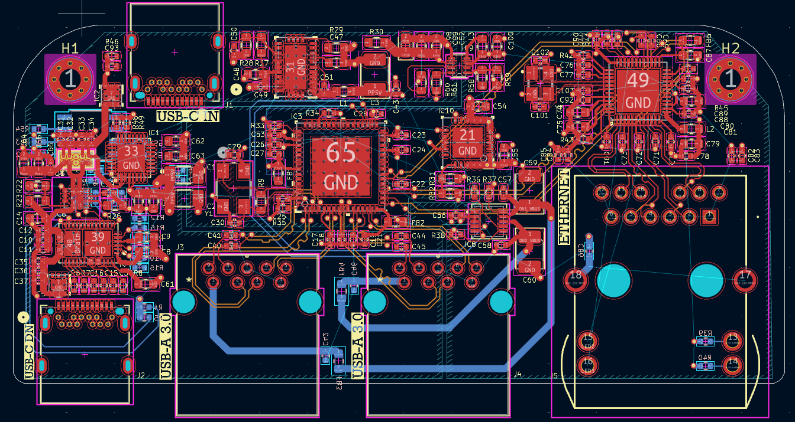
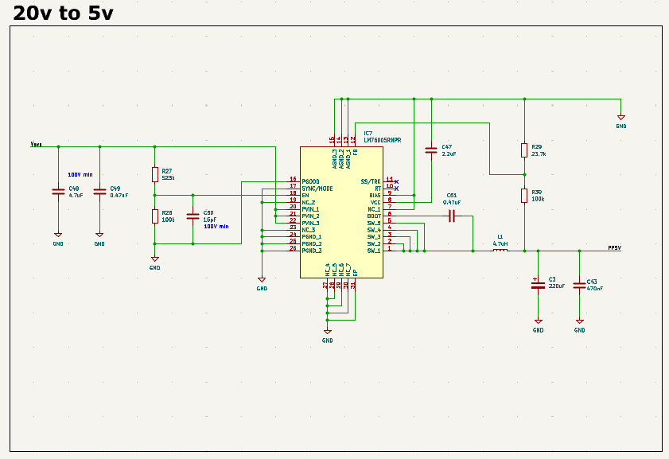
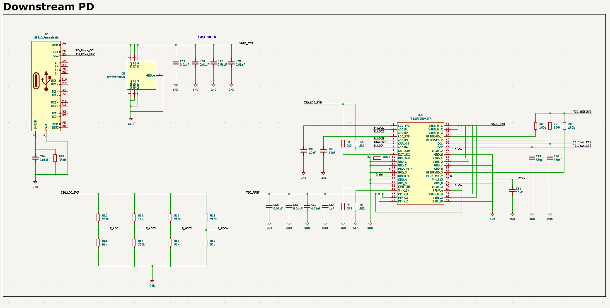
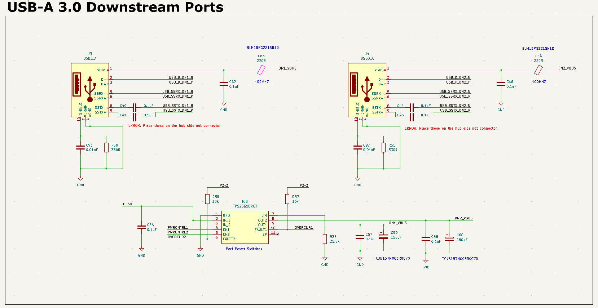
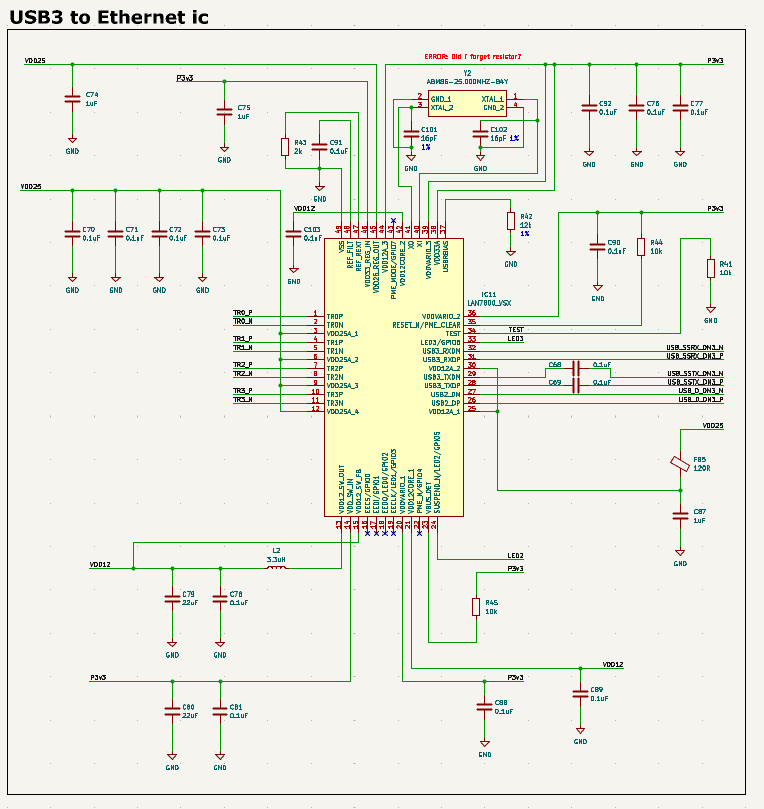
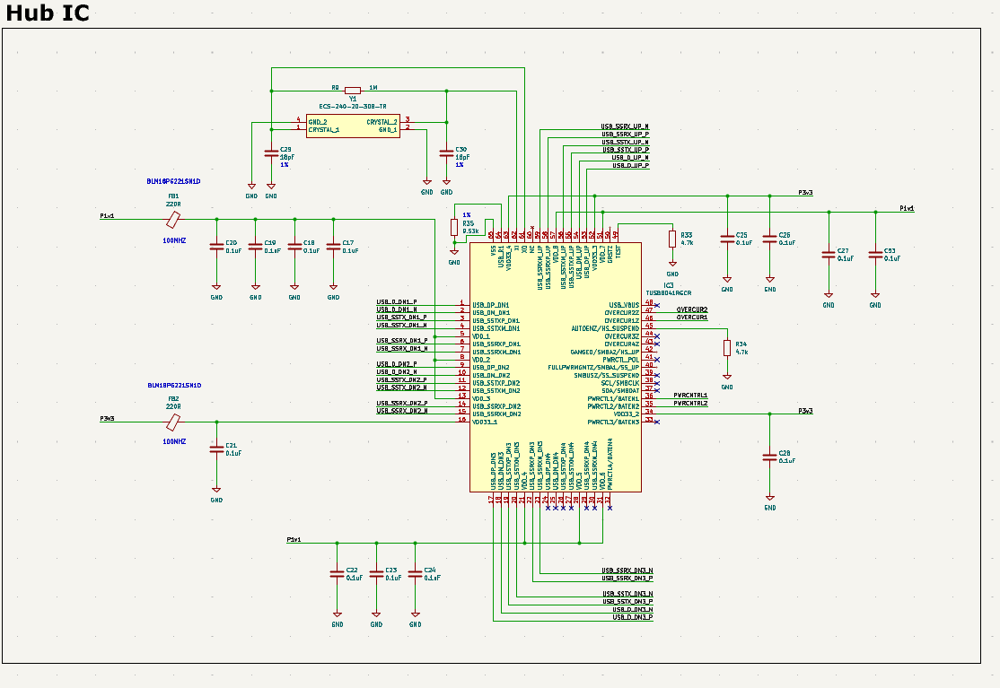
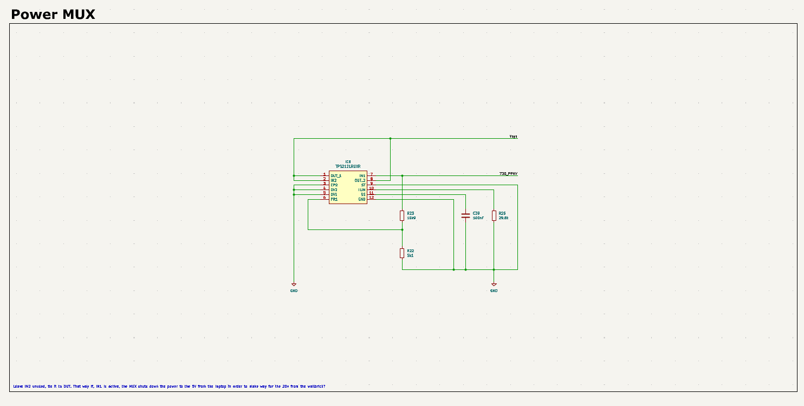
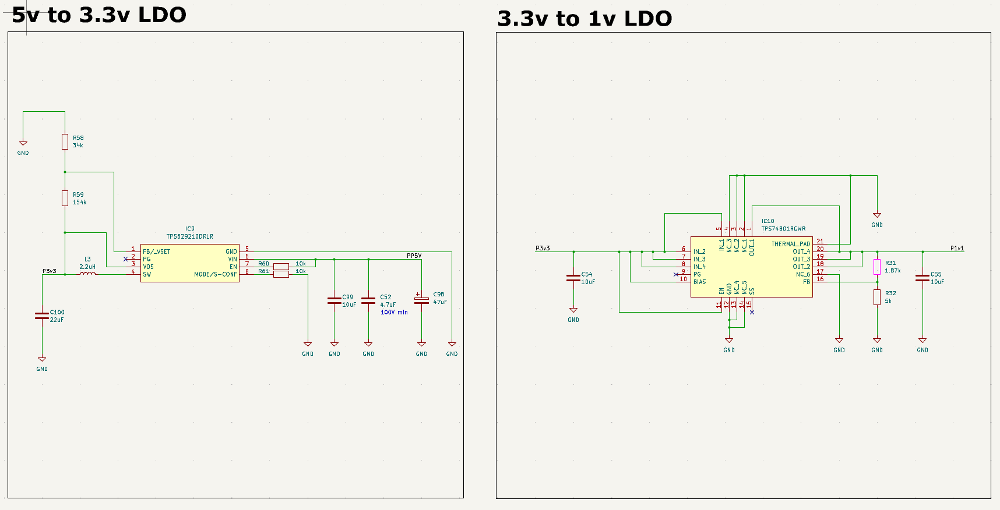
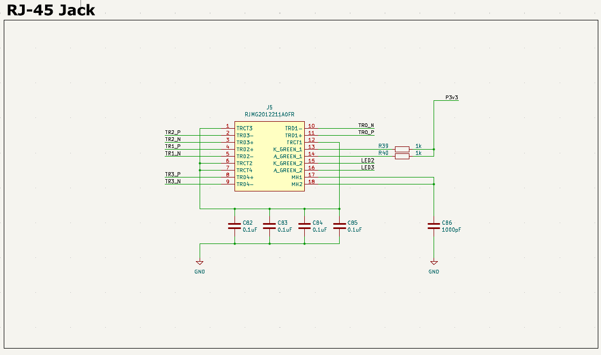

# USB‑C Hub with USB 3.0, Gigabit Ethernet, and USB‑PD

This repository documents a **custom USB‑C hub hardware design** built around a SuperSpeed USB 3.0 hub controller, USB‑PD for upstream and downstream power negotiation, integrated Gigabit Ethernet, and a robust multi‑rail power architecture.

The goal of this project is to serve as both a **fully‑featured USB‑C dock reference design** and a **learning‑driven, datasheet‑first hardware project**, emphasizing power integrity, high‑speed layout discipline, and real‑world USB‑PD behavior.

---

## High‑Level Architecture

At a system level, the design consists of:

* **USB‑C upstream port with PD sink support** (accepts up to 20 V)
* **Power MUX and buck conversion** to generate system rails
* **USB 3.0 hub controller** for multiple downstream ports
* **Two USB‑A 3.0 downstream ports** with power switches and protection
* **USB 3.0 to Gigabit Ethernet controller** with discrete RJ‑45 + magnetics
* **Dedicated 5 V, 3.3 V, and 1.0 V power rails** for digital and analog domains

Each schematic page below corresponds to a functional block of the system.

---

## 1. 20 V → 5 V Buck Converter

This section handles **high‑voltage power conversion** from USB‑PD negotiated VBUS (up to 20 V) down to the system’s primary **5 V rail (PP5V)**.

**Key points:**

* Synchronous buck regulator designed for high efficiency at elevated VIN
* Input capacitors sized for PD cable hot‑plug and inrush events
* Proper bootstrap, compensation, and soft‑start configuration
* LC output filtering to minimize ripple feeding downstream logic

The 5 V rail serves as the backbone for USB VBUS distribution, LDOs, and peripheral power.

---

## 2. Downstream USB‑C PD (Sink‑Side)

This block implements **USB‑PD sink functionality** for a downstream USB‑C port.

**Functionality:**

* CC1 / CC2 monitoring and orientation detection
* PD negotiation for safe VBUS voltage acceptance
* VBUS monitoring via ADC pins for firmware visibility
* Decoupling and filtering placed close to the PD controller

This allows the hub to correctly present itself as a compliant USB‑C device while safely managing downstream power behavior.

---

## 3. USB‑A 3.0 Downstream Ports

Two USB‑A SuperSpeed ports are implemented with **independent power control and protection**.

**Design highlights:**

* USB 3.0 differential pairs routed with controlled impedance
* AC‑coupling capacitors placed on the **hub side**, not at the connector
* Dedicated high‑side power switch IC with:

  * Programmable current limit
  * Over‑current fault reporting
* Ferrite beads and bulk capacitance for VBUS noise suppression

This ensures each downstream port is USB‑IF compliant and protected against shorts or overloads.

---

## 4. USB 3.0 → Gigabit Ethernet Controller

This section converts one USB 3.0 downstream port into **Gigabit Ethernet**.

**Features:**

* USB 3.0 SuperSpeed interface with matched differential pairs
* External 25 MHz crystal with proper load capacitance
* Separate 1.0 V, 1.2 V, and 3.3 V power domains with local decoupling
* EMI filtering on Ethernet transmit paths

The controller interfaces directly with a discrete RJ‑45 connector containing integrated magnetics.

---

## 5. USB 3.0 Hub Controller

The heart of the design is the **USB 3.0 hub IC**, responsible for upstream/downstream routing and port management.

**Responsibilities:**

* SuperSpeed and High‑Speed USB routing
* Per‑port power enable and over‑current detection
* Internal PHY power rails (1.2 V / 1.0 V)
* External crystal oscillator for hub timing

Careful attention is paid to:

* Power rail sequencing
* Decoupling capacitor placement
* Differential pair length matching and symmetry

---

## 6. Power MUX (Source Selection)

The power MUX selects between **multiple 5 V sources** (e.g., USB‑C VBUS vs auxiliary input) and feeds the system rail.

**Why this matters:**

* Prevents back‑feeding into the host
* Enables seamless power hand‑off
* Ideal‑diode behavior minimizes voltage drop

Resistor dividers and timing capacitors configure priority and switching thresholds.

---

## 7. 5 V → 3.3 V LDO

This LDO generates the primary **3.3 V rail** used by:

* USB hub I/O
* Ethernet MAC
* PD controllers
* EEPROM and logic signals

**Design notes:**

* Adequate output capacitance for transient USB loads
* EN pin controlled for clean startup
* Thermal considerations for worst‑case current draw

---

## 8. 3.3 V → 1.0 V LDO

A dedicated low‑noise LDO supplies the **1.0 V core rail** for high‑speed digital logic.

**Key considerations:**

* Tight load regulation
* Low output noise for PHY stability
* Proper grounding and short return paths

This rail is critical for USB 3.0 and Ethernet PHY reliability.

---

## 9. RJ‑45 Ethernet Jack

The Ethernet interface uses an RJ‑45 connector with **integrated magnetics and LEDs**.

**Includes:**

* Differential pair routing to magnetics
* Bob‑Smith termination via common‑mode capacitors
* LED current‑limiting resistors
* Chassis/ground reference filtering

This minimizes EMI while maintaining signal integrity at Gigabit speeds.

---

## 10. Upstream USB‑C + PD Sink

The upstream USB‑C port is the **primary host interface**.

**Capabilities:**

* USB‑PD sink negotiation (up to 20 V)
* High‑side MOSFET power path control
* VBUS monitoring and ADC feedback
* I²C‑programmable PD behavior via external EEPROM

This block defines how the entire system powers up and interacts with the host.

---

## Design Philosophy

* Datasheet‑driven design decisions
* Separation of noisy and sensitive power domains
* USB‑IF compliance awareness
* Layout‑first thinking for high‑speed signals

This project is intended as both a **functional USB‑C dock design** and a **portfolio‑level hardware reference** demonstrating real‑world mixed‑signal PCB design.

---

## Status

* Schematic: ✅ Complete
* PCB Layout: 🚧 In progress
* Bring‑up & Validation: ⏳ Planned

---

If you’re reviewing this as an engineer: feedback is welcome. If you’re learning from it: dive into the datasheets — that’s where all the real answers live.
